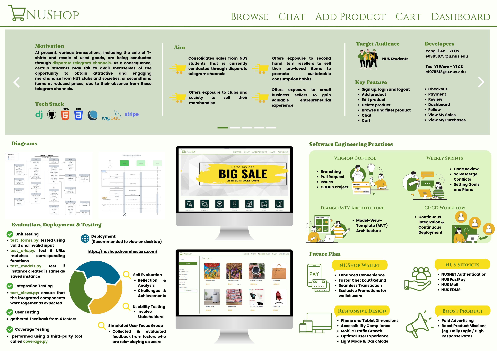

# NUShop

---

## Level of Acheivement
### [Artemis](https://credentials.nus.edu.sg/40f92ac8-7f8b-4ac4-80d6-52c3e7923341)

## Award
### [Honorable Mention](https://credentials.nus.edu.sg/47d34a3b-4160-453e-86e2-681dc0217610)

## Problem Motivation
At present, various transactions, including the sale of T-shirts and resale of used goods, are being conducted through disparate telegram channels. As a consequence, certain students may fail to avail themselves of the opportunity to obtain attractive and engaging merchandise from NUS clubs and societies, or secondhand items at reduced prices, due to their absence from these telegram channels.

## Aim
NUShop aims to create a common marketplace for NUS students, consolidating sales from different clubs and organizations. This platform celebrates the unique skills and passions of our student community, providing an opportunity for small business sellers to turn their ideas into reality and gain valuable entrepreneurial experience. Our multi-vendor app also features a dedicated space for second-hand sales, promoting sustainable consumption habits. We aim to foster creativity, innovation, and community spirit while supporting the financial and environmental well-being of our student community.

## Features

- 🪙 **Multivendor Support**: NUShop facilitates a thriving online marketplace by allowing multiple vendors to register, list their products, and manage their orders.
- 🔍**Advanced Search**: NUShop incorporates advanced search options, allowing users to filter products by category.
- 🎯 **User Authentication**: Buyers and sellers can register, log in, and manage their accounts, building trust and security within the NUShop community.
- 👨‍💼 **Product Management**: Product details, pricing, and inventory can be efficiently updated, providing sellers with full control over their listings.
- 🛒 **Shopping Cart**: NUShop features a robust shopping cart system that allows buyers to add products, review their selections, and proceed to a seamless checkout process. 
- 👨‍💻 **Order Management**: Buyers can track their orders, view order history, and manage shipments through an intuitive dashboard.
- ⭐ **Rating and Reviews**: Buyers can leave feedback on products and sellers, fostering a transparent and trustworthy marketplace. 
- 💳 **Secure Payment Processing with Stripe**: NUShop integrates Stripe for secure and efficient payment processing. 
- 💵 **NUShop Wallet**: NUShop Wallet streamlines the buying and selling process, offering users a seamless and efficient way to manage their finances.
- 🛍️ **Personalised Content**: Enhance the sense of community and relevance for users by connecting them with products that are likely to be of interest due to their academic focus. 

## User Stories
###
| As a | I want to | So that I can | Priority |
| --- | --- | --- | --- |
| buyer | search products using keyword | find the products that I need quickly | must have |
| buyer | view detailed product descriptions | make informed purchasing decisions | must have |
| buyer | track my orders | stay informed about the status of my purchases | must have |
| buyer | checkout and pay for my items | complete my purchase and receive my desired item | must have |
| buyer | filter products across multiple categories | find the products that best meet my needs | should have |
| buyer | communicate effectively with sellers | clear doubts before making purchase | should have |
| buyer | leave feedback and reviews for products | help other users make informed decisions | should have |
| seller | create a product listing with details | give more information about my products | must have |
| seller | view transaction history and ongoing transaction | ensure that I have enough products available to meet customer demand | must have |
| seller | view my sales and revenue data | track my performance and make informed decisions about my business | must have |
| seller | view and manage my orders | fulfill them in a timely manner and ensure customer satisfaction | must have |
| seller | receive and process payments securely | get paid for my products and services | must have |
| seller | access analytics and reports on my sales and customer behavior | make informed decisions about my business strategy | should have |

## Language and Tools Used

 

 

- **Django**:
NUShop leverages the Django framework, a high-level Python web framework known for its simplicity, versatility, and scalability. Django facilitates rapid development and follows the "Don't Repeat Yourself" (DRY) principle, making code clean and maintainable. It provides a secure and flexible foundation for building feature-rich web applications.

- **Stripe**:
To ensure secure and hassle-free transactions, NUShop integrates Stripe, a leading online payment processing platform. Stripe supports a wide range of payment methods, making it convenient for users worldwide to make purchases on the platform. With Stripe, NUShop ensures a secure and efficient payment experience for both buyers and sellers.

- **HTML,  CSS and Tailwind CSS**:
NUShop's foundation is built upon HTML (HyperText Markup Language), defining the structural elements and content of each web page. HTML's semantic markup ensures clarity and accessibility, forming the backbone of NUShop's intuitive user interface. The CSS in NUShop is designed to be clean and maintainable. NUShop leverages Tailwind CSS classes directly in the HTML markup, facilitating quick iteration and adaptability in design choices. This approach ensures a responsive and visually appealing layout that aligns seamlessly with NUShop's aesthetic goals.

- **Bootstrap**:
The Bootstrap Carousel is a versatile and responsive component that allows NUShop to display a rotating set of images or content in an interactive slideshow format. This feature is particularly effective for highlighting products, promotions, or any visually compelling elements on the platform.

- **SQLite and MySQL**:
During the testing stage, NUShop harnesses the power of SQLite, a lightweight and file-based relational database management system. SQLite is an excellent choice for development and testing due to its simplicity, portability, and ease of setup. It enables developers to iterate quickly and test various features without the need for a separate database server. MySQL is employed during deploy stage as the relational database management system. MySQL is renowned for its reliability, scalability, and ability to handle large datasets efficiently. This choice ensures that NUShop can seamlessly manage the complexities of a live, production environment.

- **Dreamhost**:
NUShop is hosted on Dreamhost, a reliable and feature-rich web hosting service. Dreamhost provides a robust infrastructure, ensuring high performance, security, and scalability for NUShop. With Dreamhost, NUShop aims to deliver a seamless and uninterrupted online shopping experience for users.

## Getting Started
View our deployment [here](https://nushop.dreamhosters.com/)!

## Team Members
1. Yong Li An
2. Tsui Yi Wern

Happy Shopping with NUShop! 🛒🎉
